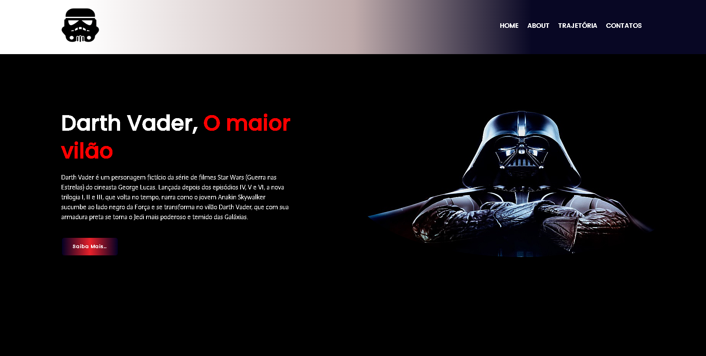

# Fanpage do Darth Vader

Esta é uma fanpage dedicada ao icônico personagem Darth Vader, do universo Star Wars. A página foi construída usando HTML e CSS e apresenta informações sobre o personagem, bem como imagens e citações memoráveis.



## Demonstração

- Veja uma demonstração ao vivo da fanpage [aqui](./source/img/screenshots/gif/giphy.gif).

## Conteúdo

- [Estrutura do Projeto](#estrutura-do-projeto)
- [Como Usar](#como-usar)
- [Personalização](#personalização)
- [Licença](#licença)

## Estrutura do Projeto

- A estrutura do projeto é organizada da seguinte forma:

  - `index.html`: Contém a estrutura HTML principal da fanpage.
  - `style`: Contém os arquivos de estilo da fanpage.
      - `global.css`
      - `style.css`
  - `img/`: Pasta que contém todas as imagens usadas na fanpage.

## Como Usar

1. Clone este repositório para o seu computador:

   ```bash
   git clone https://github.com/joseook/fanpage-star-wars.git
   ```

2. Navegue até a pasta do projeto:

   ```bash
   cd fanpage-star-wars
   ```

3. Abra o arquivo `index.html` no seu navegador para ver a fanpage do Darth Vader.

## Personalização

- Você pode personalizar a fanpage das seguintes maneiras:

### Conteúdo

- Abra o arquivo `index.html` e substitua o conteúdo conforme necessário.

### Estilos

- Personalize o estilo da fanpage editando os arquivos dentro da pasta `style`. Você pode alterar cores, fontes, tamanhos e mais de acordo com o seu gosto pessoal.

### Imagens

- Substitua as imagens na pasta `img/` pelas suas próprias imagens. Certifique-se de manter os nomes dos arquivos e atualize as referências nos arquivos HTML, se necessário.

## Licença

Este projeto está licenciado sob a Licença MIT - veja o arquivo [LICENSE](LICENSE) para detalhes.

## Notas

Este projeto é para fins educacionais e é uma homenagem ao personagem Darth Vader.

---